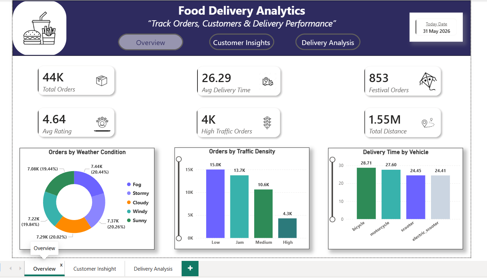
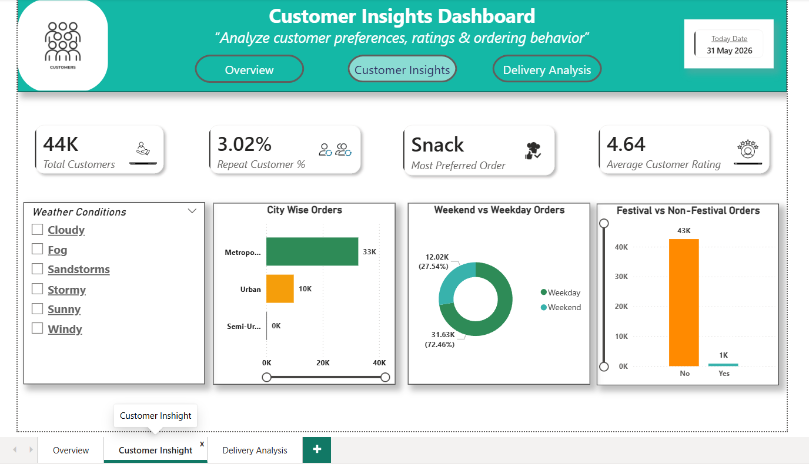
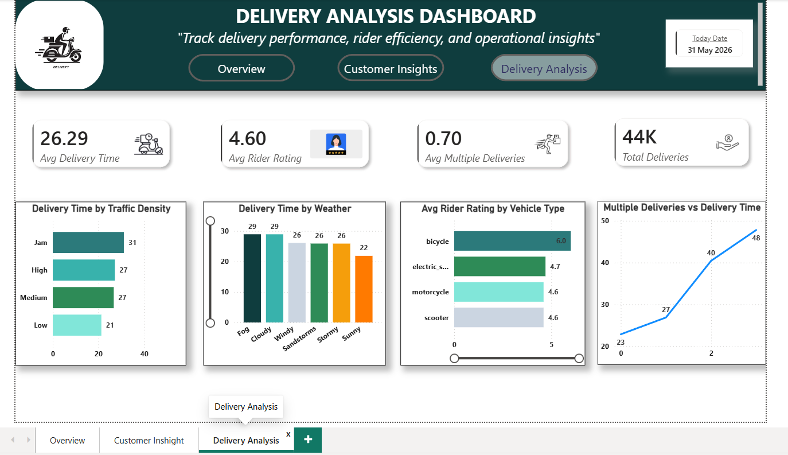

# 🍔 Food Delivery Analytics Dashboard

## 📊 Project Overview

The Food Delivery Analytics Dashboard is an interactive Business Intelligence solution developed using Power BI to analyze food delivery operations and customer behavior.

This project transforms raw delivery data into meaningful insights, helping businesses understand delivery performance, customer satisfaction, weather impact, and traffic-related challenges.

---

## 🎯 Business Objectives

* Monitor delivery performance
* Analyze customer ratings and satisfaction
* Evaluate the impact of weather and traffic conditions
* Identify operational bottlenecks
* Support data-driven decision-making

---

## 🛠️ Tools & Technologies

* Power BI
* Power Query
* DAX (Data Analysis Expressions)
* Python
* Jupyter Notebook
* Microsoft Excel

---

## 📂 Project Structure

```text
Food-Delivery-Analytics-Dashboard/
│
├── Food_Delivery.ipynb
├── Food_Delivery_Dashboard.pbix
├── cleaned_food_delivery.csv
├── requirements.txt
├── .gitignore
└── screenshots/
```

---

## 📊 Dashboard Pages

### 📍 Overview

Provides a high-level summary of delivery operations through KPI cards and performance indicators.

**Key Metrics**

* Total Orders
* Average Delivery Time
* Average Customer Rating
* Festival Orders
* Traffic Analysis
* Weather Analysis

### 👥 Customer Insights

Analyzes customer behavior and ordering patterns.

**Includes**

* Customer Ratings Analysis
* City-wise Order Distribution
* Festival Impact
* Order Trends

### 🚚 Delivery Analysis

Focuses on delivery efficiency and operational performance.

**Includes**

* Delivery Time by Weather Condition
* Delivery Time by Traffic Density
* Vehicle-wise Performance
* Delivery Trend Analysis

---

## 📷 Dashboard Preview

### Overview Dashboard



### Customer Insights Dashboard



### Delivery Analysis Dashboard



---

## 🔍 Key Insights

* Traffic congestion significantly increases delivery time.
* Weather conditions directly affect operational efficiency.
* Vehicle type influences delivery performance.
* Customer ordering behavior varies across locations and events.
* Festival periods can impact delivery demand and workload.

---

## 🚀 Project Workflow

Data Collection → Data Cleaning → Exploratory Data Analysis → Data Transformation → Dashboard Development → Business Insights

---

## 📈 Skills Demonstrated

* Data Cleaning
* Exploratory Data Analysis (EDA)
* Data Visualization
* Dashboard Design
* Business Intelligence
* DAX Measures
* Power Query Transformations
* KPI Development

---

## 👨‍💻 Author

**Pratikkumar Parmar**

Software Engineering Graduate

Aspiring Data Analyst

GitHub: https://github.com/PratikParnar

---

## ⭐ If you found this project useful, consider giving it a star.
